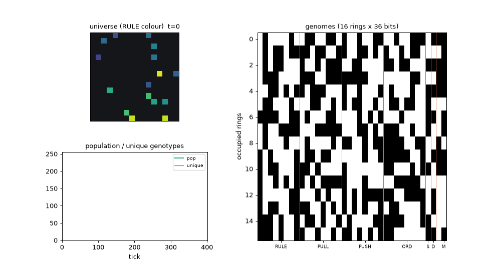
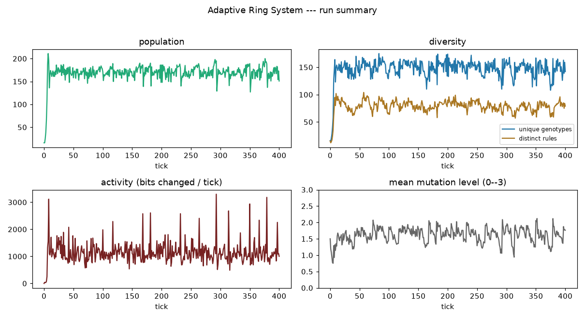

# Adaptive Ring System

A finite universe of self-modifying "rings." Each ring is 36 bits and is at
once data, an elementary cellular-automaton rule, and a node in a
transformation network --- there is no controller, fitness, or energy. All
behaviour emerges from rings transforming one another and themselves under
reproduction, mutation, death, and a hard population cap.

The full specification and every design decision (with rationale) is in
[`DESIGN.md`](DESIGN.md). Read that first.

## Files

| file                  | purpose                                            |
|-----------------------|----------------------------------------------------|
| `DESIGN.md`           | specification + resolved ambiguities + rationale   |
| `ring_system.py`      | the simulator (semantics, tick cycle, logging)     |
| `test_ring_system.py` | tests for the load-bearing semantics               |
| `viz.py`              | dashboard viewer (animated GIF + summary figure)   |
| `run.py`              | CLI: run a simulation, log, save history, render    |
| `artifact.html`       | self-contained interactive dashboard (live knobs)  |
| `RESEARCH_PLAN.md`    | operational defs + metrics for "self-organization" |
| `analyze.py`          | discriminating metrics (churn vs. organization)    |
| `experiments.py`      | battery of configs + side-by-side metric table     |
| `EXPERIMENTS.md`      | experiment log (findings, interpretation)          |
| `NOTES.md`            | running log of observations                         |

The simulator has experimental knobs (`mut_scale`, `protect`, `transform_off`,
`spawn_code`/`death_code` for a heritable reproduction trigger, `base_death`
for tunable turnover, and `local_addr` for spatial dynamics) whose defaults
reproduce the faithful spec; `artifact.html` exposes them as live controls.
See `RESEARCH_PLAN.md` and `EXPERIMENTS.md` for the iteration toward emergent
self-organization --- the headline result so far is that local addressing plus
a heritable rule produces emergent spatial domains (E4).

## How to run

```bash
pip install numpy matplotlib pillow

python3 test_ring_system.py                 # 12 tests, all should pass

python3 run.py --ticks 400 --init 16 --render
#   -> out/metrics.jsonl   per-tick metrics (one JSON object per line)
#   -> out/history.npz     state history for replay
#   -> out/summary.png     whole-run metric figure
#   -> out/evolution.gif   animated dashboard

# re-render an existing run without re-simulating:
python3 viz.py out/history.npz --gif out/evolution.gif --summary out/summary.png
```

`run.py --init 1` starts from a single ring; `--init N` from N random rings.
`--print-every K` prints a readable metric line every K ticks.

## Reading the dashboard

- **universe grid** --- the 256 slots as a 16x16 grid, coloured by each
  ring's RULE value; dark cells are empty slots.
- **genome raster** --- every occupied ring as a row of 36 bits, with the
  RULE / PULL / PUSH / ORDER / SPAWN / DEATH / MUTATION field boundaries
  marked. This is the population's DNA at a glance.
- **traces** --- population and diversity over time; the summary figure adds
  activity (bits changed per tick) and mean mutation level.

## Sample output

A 400-tick run from 16 random rings (`run.py --ticks 400 --init 16`):





## What we observe

From random seeds the system settles into a non-degenerate regime: it neither
freezes nor saturates. Population self-stabilises well below the cap with
continuous birth/death turnover and high genotypic diversity. See `NOTES.md`.
